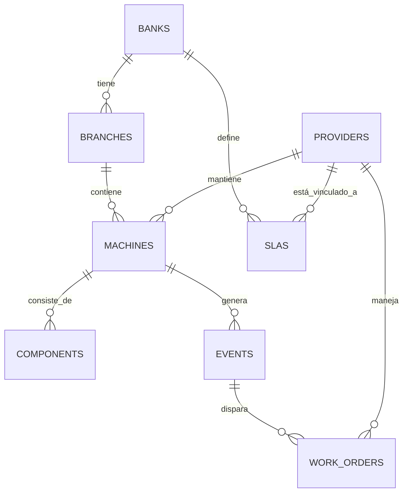

# Arquitectura y Modelo de Datos para Plataforma SaaS de Monitorización Bancaria

## Descripción General

Esta plataforma SaaS está diseñada para bancos que necesitan monitorizar hardware como cajeros automáticos (ATMs), recicladores de billetes y contadoras. Soporta gestión multi-banco y multi-proveedor, con énfasis en seguridad bancaria, cifrado AES-256 para datos sensibles y JWT para autenticación de sesiones.

La arquitectura sigue un enfoque de microservicios con separación clara entre capas: ingesta de datos, lógica de negocio, inteligencia artificial y presentación.

## Infraestructura Técnica

- **Backend**: Node.js con Express para APIs RESTful.
- **Base de Datos**: PostgreSQL para datos relacionales y escalabilidad.
- **Agentes Hardware**: Scripts en Python (o Rust para mayor seguridad) desplegados en cada máquina.
- **Motor de IA**: Scikit-learn o TensorFlow para mantenimiento predictivo.
- **Frontend**: React con Tailwind CSS para dashboards interactivos.
- **Seguridad**: Cifrado AES-256 para transmisión de datos, firma digital para autenticidad, y cumplimiento con estándares bancarios.

## Esquema de Base de Datos PostgreSQL

### Tablas Principales

```sql
-- Bancos
CREATE TABLE banks (
    id SERIAL PRIMARY KEY,
    name VARCHAR(255) NOT NULL,
    code VARCHAR(10) UNIQUE,
    created_at TIMESTAMP DEFAULT CURRENT_TIMESTAMP
);

-- Proveedores de mantenimiento
CREATE TABLE providers (
    id SERIAL PRIMARY KEY,
    name VARCHAR(255) NOT NULL,
    contact_email VARCHAR(255),
    created_at TIMESTAMP DEFAULT CURRENT_TIMESTAMP
);

-- Sucursales bancarias
CREATE TABLE branches (
    id SERIAL PRIMARY KEY,
    bank_id INTEGER REFERENCES banks(id) ON DELETE CASCADE,
    name VARCHAR(255),
    address TEXT,
    latitude DECIMAL(10,8),
    longitude DECIMAL(11,8),
    created_at TIMESTAMP DEFAULT CURRENT_TIMESTAMP
);

-- Máquinas (ATMs, recicladores, etc.)
CREATE TABLE machines (
    id SERIAL PRIMARY KEY,
    branch_id INTEGER REFERENCES branches(id) ON DELETE CASCADE,
    provider_id INTEGER REFERENCES providers(id),
    type VARCHAR(50), -- 'ATM', 'Recycler', 'Counter'
    model VARCHAR(100),
    serial_number VARCHAR(100) UNIQUE,
    firmware_version VARCHAR(50),
    installed_at TIMESTAMP,
    status VARCHAR(20) DEFAULT 'active', -- 'active', 'inactive', 'maintenance'
    created_at TIMESTAMP DEFAULT CURRENT_TIMESTAMP
);

-- Componentes de máquinas (huella digital con números de serie)
CREATE TABLE components (
    id SERIAL PRIMARY KEY,
    machine_id INTEGER REFERENCES machines(id) ON DELETE CASCADE,
    type VARCHAR(100), -- 'dispenser', 'sensor', 'roller', etc.
    serial_number VARCHAR(100) UNIQUE,
    installed_at TIMESTAMP,
    replaced_at TIMESTAMP,
    created_at TIMESTAMP DEFAULT CURRENT_TIMESTAMP
);

-- Contratos de SLA
CREATE TABLE slas (
    id SERIAL PRIMARY KEY,
    bank_id INTEGER REFERENCES banks(id) ON DELETE CASCADE,
    provider_id INTEGER REFERENCES providers(id) ON DELETE CASCADE,
    response_time_hours INTEGER, -- tiempo máximo de respuesta en horas
    uptime_percentage DECIMAL(5,2), -- porcentaje de uptime requerido, e.g., 99.9
    penalty_per_hour DECIMAL(10,2), -- multa por hora de retraso
    effective_from DATE,
    effective_to DATE,
    created_at TIMESTAMP DEFAULT CURRENT_TIMESTAMP
);

-- Eventos de hardware (logs)
CREATE TABLE events (
    id SERIAL PRIMARY KEY,
    machine_id INTEGER REFERENCES machines(id) ON DELETE CASCADE,
    timestamp TIMESTAMP NOT NULL,
    type VARCHAR(100), -- 'error', 'warning', 'info'
    description TEXT,
    severity VARCHAR(20), -- 'low', 'medium', 'high', 'critical'
    resolved BOOLEAN DEFAULT FALSE,
    created_at TIMESTAMP DEFAULT CURRENT_TIMESTAMP
);

-- Órdenes de Trabajo (OT)
CREATE TABLE work_orders (
    id SERIAL PRIMARY KEY,
    event_id INTEGER REFERENCES events(id) ON DELETE CASCADE,
    provider_id INTEGER REFERENCES providers(id),
    assigned_technician VARCHAR(255),
    status VARCHAR(50) DEFAULT 'open', -- 'open', 'in_progress', 'closed'
    opened_at TIMESTAMP DEFAULT CURRENT_TIMESTAMP,
    arrived_at TIMESTAMP, -- hora de llegada del técnico
    resolved_at TIMESTAMP,
    notes TEXT,
    penalty_amount DECIMAL(10,2) DEFAULT 0,
    created_at TIMESTAMP DEFAULT CURRENT_TIMESTAMP
);
```

### Diagrama de Entidad-Relación



## Estructura de Carpetas del Proyecto

```
/project-root
├── /backend
│   ├── /api          # Endpoints REST
│   ├── /models       # Modelos de datos y consultas SQL
│   ├── /services     # Lógica de negocio (auditoría, penalizaciones)
│   ├── /auth         # Autenticación JWT
│   └── /utils        # Utilidades (cifrado, etc.)
├── /agents
│   ├── /python       # Scripts de agentes hardware
│   └── /rust         # Versión en Rust para seguridad
├── /ml
│   ├── /models       # Modelos de ML entrenados
│   ├── /scripts      # Entrenamiento y predicción
│   └── /data         # Datos históricos
├── /frontend
│   ├── /src
│   │   ├── /components  # Componentes React
│   │   ├── /pages       # Páginas del dashboard
│   │   └── /services    # Llamadas a API
│   └── /public
├── /docs
│   ├── architecture_and_database.md
│   └── api_docs.md
├── /tests            # Pruebas unitarias e integración
├── package.json      # Dependencias backend/frontend
├── requirements.txt  # Dependencias Python
└── docker-compose.yml # Orquestación de servicios
```

Esta arquitectura proporciona una base sólida para el desarrollo incremental de la plataforma, comenzando por la base de datos y expandiendo a las capas superiores.
